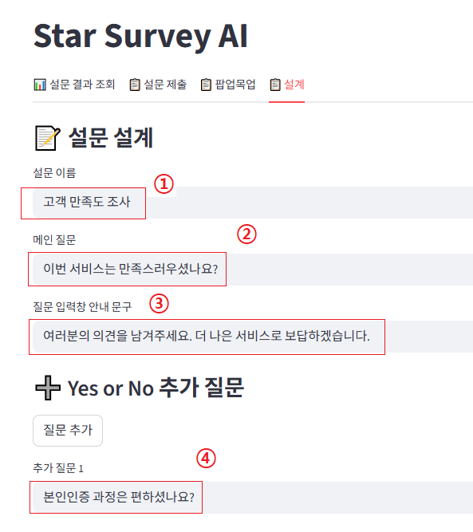
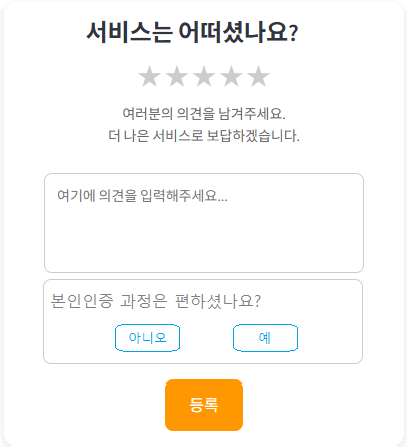

# 🧠 Star Survey AI - 별점 만족도 설문 리포트 제공 서비스

## 🤩 이 것을 고안한 이유
- 대고객으로부터 서비스 만족도를 받는 것은 서비스의 질을 향상시키는데 큰 도움이 됨
- 수집된 만족도 설문 내용을 모두 일일히 검토하는건 고된 일.
- 매일 00시, 하루동안 모인 설문 내용을 수집하고 AI가 그것을 요약해서 어떤 중요한 피드백이 있었는지 한눈에 제공하면 좋겠다는 생각이 들었음.
---
- 관리자용 설문 설계 portal 이 있고, 그곳에서 관리자는 질문 가능.
<br>




## ✨ 비지니스 모델
- 편리하게 UI상에서 설문에 대한 설계를 하고, 결과를 분석해서 이메일로 받을 수 있는 서비스를 제공하는 대가로
- 구독료 받기
- 설문 팝업 아래 광고 배너 삽입

## 🚀 주요 기능

### 📋 설문 관리자 페이지 제공 (추후개발)
- 설문을 설계하고, 관리자는 수집된 만족도를 조회할 수 있는 포탈 제공

### 📋 설문 제출 팝업 제공
- 성별, 나이대, 별점, 자유 피드백을 입력받는다.

### 📝 AI 보고서 생성
- 선택된 날짜의 피드백을 기반으로 AI가 자동 요약 보고서 생성
- 긍정적 평가, 개선 필요 사항, 인사이트, 추천 액션 포함
- 템플릿 기반 Markdown 보고서 출력

### 📧 이메일 전송 (추후개발)
- 매일 00시, 전일 수집된 응답을 기반으로 보고서를 제작
- 이메일로 발송할 수 있도록 기능 제공

---

## 🛠️ 기술 스택

- **Frontend**: Streamlit --> ***[추후 React/Typescript 등으로 개선]***
- **Backend AI**: Azure OpenAI (GPT-4.1-mini)
- **Search & Storage**: Azure Cognitive Search --> ***[추후 PostgreSQL, Redis 등 사용하여 성능개선]***
- **Deployment**: Azure App Service (Linux) --> ***[추후 AKS, Github action, ArgoCD 등 배포 편리성 및 스케일링 관리 개선]***
- **Email**: SMTP

---

## ⚙️ 환경 설정 (.env)

```env
OPENAI_API_KEY=your_openai_key
AZURE_OPENAI_ENDPOINT=https://your-endpoint.openai.azure.com/
OPENAI_API_VERSION=2023-07-01-preview
SEARCH_ENDPOINT=https://your-search-endpoint.search.windows.net
SEARCH_API_KEY=your_search_key
INDEX_NAME=survey-index
EMAIL_HOST=smtp.gmail.com
EMAIL_PORT=587
EMAIL_ADDRESS=your_email@gmail.com
EMAIL_PASSWORD=your_app_password
```

## 의존성
```
streamlit
pandas
python-dotenv
openai
azure-search-documents
azure-core
```
---
## 개선방향 
1. 
---
## 💢 Trouble Shooting

## 만들며 어려웠던 점

## 시연 페이지
https://pro-hankil-webapp-1-gsbfbscrgfdtfcaa.swedencentral-01.azurewebsites.net/

